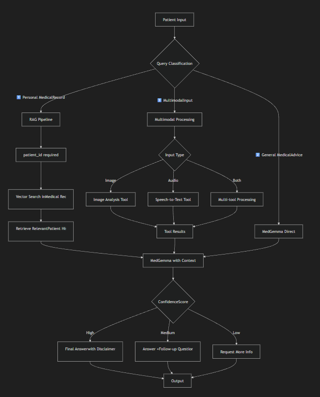
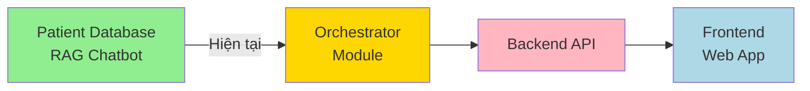

# BÁO CÁO TỔNG QUAN DỰ ÁN - HỆ THỐNG AI AGENTS TƯ VẤN Y TẾ

**Ngày tạo**: 13/02/2026  
**Trạng thái dự án**: Đang phát triển  
**Mục tiêu**: Xây dựng hệ thống AI Agents phục vụ tư vấn y tế cho bệnh viện

---

## 📋 1. THÔNG TIN DỰ ÁN

### 1.1. Mục Tiêu Tổng Quan

Triển khai hệ thống AI Agents phục vụ cho bệnh viện với vai trò **tư vấn về y tế cho bệnh nhân**. Hệ thống cho phép:

- 🩺 **Tư vấn y tế thông minh**: Bệnh nhân có thể hỏi đáp về các vấn đề y tế thông qua chatbot
- 📋 **Tra cứu hồ sơ bệnh án**: Truy vấn thông tin lịch sử bệnh án cá nhân
- 🖼️ **Phân tích hình ảnh**: Nhận diện và phân loại bệnh da liễu từ ảnh
- 🎤 **Nhận dạng giọng nói**: Chuyển đổi giọng nói y tế thành văn bản

### 1.2. Người Dùng Mục Tiêu

**User**: Bệnh nhân của bệnh viện
- Có ID và hồ sơ bệnh án được lưu trong Medical Record của bệnh viện
- Có quyền truy cập thông tin y tế cá nhân
- Tương tác với hệ thống qua text, hình ảnh, hoặc giọng nói

### 1.3. Cấu Trúc Dự Án

```
medscreening/
├── agents/
│   ├── image_process/          # Module phân loại da liễu
│   │   ├── data/               # Dữ liệu và models
│   │   ├── models/             # Model đã train
│   │   └── tools/              # LangGraph tools
│   ├── speech_to_text_process/ # Module nhận dạng giọng nói
│   │   ├── model/              # MedASR model
│   │   ├── notebook/           # Notebooks phát triển
│   │   └── tools/              # LangGraph tools
│   ├── patient_database/       # Module quản lý bệnh án
│   │   ├── data/               # Dữ liệu bệnh viện (16 CSV files)
│   │   ├── medical_record/     # Xử lý medical records
│   │   └── rag_pipeline/       # RAG chatbot pipeline
│   └── data/                   # Shared data
├── medgemma/                   # MedGemma LLM model
│   └── google_medgemma_4b_it/  # Model 4B parameters
├── docs/                       # Tài liệu dự án
└── scripts/                    # Utility scripts
```

---

## 🏗️ 2. KIẾN TRÚC HỆ THỐNG

### 2.1. Kiến Trúc Decision Flow

Trong hệ thống bệnh viện, câu hỏi sẽ được phân loại và xử lý theo **3 nhóm chính**:


#### 1️⃣ Personal Medical Record Query

**Mô tả**: Câu hỏi về thông tin cá nhân trong hồ sơ bệnh án

**Ví dụ**:
- "BMI của tôi năm 2010 là bao nhiêu?"
- "Tôi có tiền sử dị ứng gì không?"
- "Tôi đã tiêm vaccine gì?"
- "Lịch sử khám bệnh của tôi?"

**Xử lý**:
- ✅ **Yêu cầu**: `patient_id` (authentication)
- ✅ **Dùng RAG Pipeline**: Vector search trong medical records
- ✅ **Retrieve**: Relevant patient history chunks
- ✅ **MedGemma**: Trả lời dựa trên context từ RAG

**Flow**:
```
User Query + patient_id → RAG Vector Search → Retrieve Context → MedGemma(query + context) → Answer
```

---

#### 2️⃣ General Medical Advice

**Mô tả**: Câu hỏi y tế chung, không liên quan đến hồ sơ cá nhân

**Ví dụ**:
- "Bị đau đầu nên làm gì?"
- "Triệu chứng của sốt xuất huyết là gì?"
- "Cách phòng ngừa bệnh tiểu đường?"
- "Vitamin C có tác dụng gì?"

**Xử lý**:
- ❌ **Không cần RAG**
- ✅ **MedGemma trả lời trực tiếp** (dựa vào kiến thức pretrained)
- ✅ **Kèm disclaimer** y tế

**Flow**:
```
User Query → MedGemma(query) → General Medical Answer + Disclaimer
```

---

#### 3️⃣ Multimodal Case

**Mô tả**: Câu hỏi kèm hình ảnh hoặc audio

**Ví dụ**:
- Upload ảnh da + "Tôi bị gì?"
- Giọng nói: "Em bé bị phát ban ở tay"
- Ảnh + giọng nói kết hợp

**Xử lý**:
- ✅ **Orchestrator gọi tools**:
  - `analyze_skin_image` cho ảnh da
  - `speech_to_text` cho audio
- ✅ **Tổng hợp kết quả** từ tools
- ✅ **MedGemma giải thích** dựa trên tool results
- ✅ **Tùy chọn**: Kết hợp với RAG nếu có `patient_id`

**Flow**:
```
User Image/Audio → Tool Execution → Tool Results → MedGemma(results + query) → Explained Answer
```

### 2.2. Các Module Chính

#### Module 1️⃣: **Skin Classification** ✅ Hoàn thiện

**Mô tả**: Phân loại hình ảnh da vào 8 nhóm bệnh da liễu

**Công nghệ**:
- Model pretrained: **Derm Foundation** (Google)
- Classifier: **Logistic Regression**
- Framework: TensorFlow, Keras

**8 Classes**:
1. `Eczema_Dermatitis` - Chàm/Viêm da
2. `Bacterial_Infections` - Nhiễm trùng vi khuẩn
3. `Fungal_Infections` - Nhiễm nấm
4. `Viral_Infections` - Nhiễm virus
5. `Infestations` - Ký sinh trùng/Côn trùng
6. `Acneiform` - Dạng mụn trứng cá
7. `Vascular_Benign` - U máu lành tính
8. `Healthy_Skin` - Da khỏe mạnh

**Input**: Ảnh da (JPG/PNG)  
**Output**: JSON với class prediction, confidence score, và probabilities

**LangGraph Tool**: `analyze_skin_image`

**Implementation**:
- File: [`image_analyzer.py`](file:///c:/Users/lammi/Downloads/medscreening/agents/image_process/tools/image_analyzer.py)
- LangGraph integration: [`langgraph_tools.py`](file:///c:/Users/lammi/Downloads/medscreening/agents/image_process/tools/langgraph_tools.py)
- Lazy loading models để tối ưu performance
- Comprehensive error handling

---

#### Module 2️⃣: **Speech-to-Text** ✅ Hoàn thiện

**Mô tả**: Chuyển đổi audio y tế thành văn bản định dạng y tế

**Công nghệ**:
- Model: **Google MedASR** (Medical Automatic Speech Recognition)
- Framework: Hugging Face Transformers
- Decoder: CTC Beam Search với KenLM language model (optional)

**Input**: Audio file (WAV format, 16kHz recommended)  
**Output**: Transcribed text định dạng y tế

**LangGraph Tool**: `speech_to_text`

**Implementation**:
- File: [`speech_to_text.py`](file:///c:/Users/lammi/Downloads/medscreening/agents/speech_to_text_process/tools/speech_to_text.py)
- Custom decoder: `LasrCtcBeamSearchDecoder` với text restoration
- Chunking support cho audio dài
- Lazy model initialization

---

#### Module 3️⃣: **Patient Database** 🚧 Đang phát triển

**Mô tả**: Quản lý và truy vấn hồ sơ bệnh án, cung cấp RAG Chatbot

**Dữ liệu**: 16 bảng CSV từ hệ thống bệnh viện

**Thống kê dữ liệu**:
- 📊 **1,171 bệnh nhân**
- 📊 **53,346 lượt khám** (trung bình 45.6 lượt/bệnh nhân)
- 📊 **299,697 observations** (chỉ số sinh tồn, xét nghiệm)
- 📊 **42,989 đơn thuốc**
- 📊 **34,981 thủ thuật y tế**
- 📊 **8,376 chẩn đoán**

**Các bảng dữ liệu**:
- `patients` - Thông tin bệnh nhân (nhân khẩu học)
- `encounters` - Lượt khám bệnh
- `observations` - Dấu hiệu sinh tồn, xét nghiệm
- `medications` - Đơn thuốc
- `procedures` - Thủ thuật y tế
- `conditions` - Chẩn đoán bệnh
- `immunizations` - Tiêm chủng
- `allergies` - Dị ứng
- `careplans` - Kế hoạch chăm sóc
- `imaging_studies` - Hình ảnh y học
- `organizations` - Cơ sở y tế
- `providers` - Bác sĩ/nhà cung cấp
- ... và 4 bảng khác

**LangGraph Tools đã có**:
1. `patient_lookup` - Tra cứu thông tin nhân khẩu học
2. `medical_history` - Lấy lịch sử bệnh án (bệnh nền, thuốc, dị ứng)
3. `observation_lookup` - Truy vấn dấu hiệu sinh tồn

**RAG Pipeline** 🚧 Đang phát triển:
- [`batch_embed.py`](file:///c:/Users/lammi/Downloads/medscreening/agents/patient_database/rag_pipeline/batch_embed.py) - Batch embedding
- [`episode_builder.py`](file:///c:/Users/lammi/Downloads/medscreening/agents/patient_database/rag_pipeline/episode_builder.py) - Xây dựng episode từ medical records
- [`faiss_index.py`](file:///c:/Users/lammi/Downloads/medscreening/agents/patient_database/rag_pipeline/faiss_index.py) - FAISS vector database
- [`narrative_transformer.py`](file:///c:/Users/lammi/Downloads/medscreening/agents/patient_database/rag_pipeline/narrative_transformer.py) - Chuyển đổi data thành narrative
- [`parser.py`](file:///c:/Users/lammi/Downloads/medscreening/agents/patient_database/rag_pipeline/parser.py) - Parse medical records
- [`pipeline.py`](file:///c:/Users/lammi/Downloads/medscreening/agents/patient_database/rag_pipeline/pipeline.py) - Pipeline orchestrator

**Mục tiêu hiện tại**:
- ✅ Phân tích EDA toàn bộ dữ liệu (đã hoàn thành)
- 🚧 Hoàn thiện chunking data
- 🚧 Cấu hình RAG Chatbot với vector database
- 🚧 Tích hợp MedGemma LLM

---

#### Module 4️⃣: **Orchestrator** 📋 Kế hoạch

**Mô tả**: Điều phối toàn bộ luồng decision flow, tích hợp tất cả modules

**Kế hoạch triển khai** (từ conversation 90aed562):

**Components**:
1. **Agent Orchestration Layer** - LangGraph StateGraph
2. **Emergency Detection** - Phát hiện tình huống khẩn cấp
3. **Multi-Modal Processing Coordinator** - Xử lý đa phương thức
4. **Patient History Retrieval** - Tổng hợp lịch sử bệnh nhân
5. **LLM Medical Reasoning Engine** - MedGemma reasoning
6. **Confidence Scoring System** - Tính toán confidence (< 60%, 60-80%, > 80%)
7. **Escalation Logic** - Xác định khi cần chuyển bác sĩ
8. **Output Generation** - Format output với disclaimer

**Approach**:
- Sử dụng **LangGraph StateGraph** để quản lý state và luồng
- **Rule-based Emergency Detection** ban đầu (keywords, vital signs)
- **MedGemma** làm reasoning engine chính
- MedGemma có quyền:
  - Tiếp tục cuộc trò chuyện
  - Gọi RAG Chatbot tool
  - Gọi các tools khác khi cần

**Files cần tạo**:
- `agents/orchestrator/agent_orchestrator.py`
- `agents/orchestrator/graph_builder.py`
- `agents/emergency/emergency_detector.py`
- `agents/processing/multimodal_processor.py`
- `agents/reasoning/reasoning_engine.py`
- `agents/evaluation/confidence_scorer.py`
- `agents/evaluation/escalation_checker.py`
- `agents/output/output_generator.py`

---

## 🔧 3. CÔNG NGHỆ SỬ DỤNG

### 3.1. AI/ML Stack

| Công nghệ | Mục đích | Trạng thái |
|-----------|----------|-----------|
| **Google MedGemma 4B** | LLM reasoning engine y tế | ✅ Đã tải về |
| **Google Derm Foundation** | Image embedding cho da liễu | ✅ Đang dùng |
| **Google MedASR** | Speech-to-text y tế | ✅ Đang dùng |
| **Logistic Regression** | Skin classification | ✅ Đã train |
| **FAISS** | Vector database cho RAG | 🚧 Đang cấu hình |
| **LangGraph** | Agent orchestration framework | ✅ Đang dùng |
| **Sentence Transformers** | Text embedding cho RAG | 🚧 Đang cấu hình |

### 3.2. Python Libraries

**Core**:
- `langgraph` - Agent orchestration
- `transformers` - Hugging Face models
- `tensorflow` / `keras` - Deep learning
- `torch` - PyTorch backend

**Data & ML**:
- `pandas` - Data manipulation
- `numpy` - Numerical computing
- `scikit-learn` - ML algorithms
- `joblib` - Model serialization

**NLP & Speech**:
- `librosa` - Audio processing
- `pyctcdecode` - CTC decoding
- `sentence-transformers` - Text embeddings

**Vector DB**:
- `faiss-cpu` - Vector similarity search
- `chromadb` - Alternative vector DB

**Utilities**:
- `pydantic` - Data validation
- `python-dotenv` - Environment management
- `logging` - Logging framework

---

## 📊 4. TIẾN ĐỘ HIỆN TẠI

### 4.1. Hoàn Thành ✅

#### ✅ Module Skin Classification (100%)
- [x] Research và chọn model (Derm Foundation)
- [x] Train Logistic Regression classifier
- [x] Tạo ImageAnalyzerTool class
- [x] Đóng gói thành LangGraph tool
- [x] Lazy model loading
- [x] Error handling và validation
- [x] Testing và inference notebook

#### ✅ Module Speech-to-Text (100%)
- [x] Research và chọn model (MedASR)
- [x] Tạo SpeechToTextTool class
- [x] Custom CTC decoder với text restoration
- [x] Đóng gói thành LangGraph tool
- [x] Lazy model initialization
- [x] Support chunking cho audio dài
- [x] Testing notebook

#### ✅ Patient Database - Data Analysis (100%)
- [x] Load và phân tích 16 bảng CSV
- [x] EDA toàn diện (1,171 bệnh nhân, 470K+ records)
- [x] Hiểu schema và relationships
- [x] Tạo script tự động hóa phân tích
- [x] Tạo LangGraph tools cơ bản (patient_lookup, medical_history, observation_lookup)

### 4.2. Đang Phát Triển 🚧

#### 🚧 Patient Database - RAG Pipeline (70%)

**Đã có**:
- [x] RAG pipeline structure
- [x] Episode builder logic
- [x] Narrative transformer
- [x] Parser for medical records
- [x] FAISS index setup
- [x] Batch embedding utilities

**Cần hoàn thiện**:
- [ ] Hoàn thiện chunking strategy cho medical narratives
- [ ] Cấu hình embedding model (Sentence Transformers)
- [ ] Build và index toàn bộ medical records
- [ ] Tạo RAG retrieval tool
- [ ] Testing retrieval quality
- [ ] Tích hợp với MedGemma

### 4.3. Chưa Bắt Đầu 📋

#### 📋 Module Orchestrator (0%)

Theo kế hoạch từ conversation 90aed562:
- [ ] Agent Orchestration Layer (LangGraph StateGraph)
- [ ] Emergency Detection Module
- [ ] Multi-Modal Processing Coordinator
- [ ] Patient History Retrieval (wrapper around tools)
- [ ] LLM Medical Reasoning Engine (MedGemma integration)
- [ ] Confidence Scoring System
- [ ] Escalation Logic
- [ ] Output Generation với disclaimer

#### 📋 Backend API (0%)
- [ ] FastAPI REST API
- [ ] Input validation
- [ ] File upload handling (images, audio)
- [ ] Authentication & authorization
- [ ] Rate limiting
- [ ] Logging và monitoring

#### 📋 Frontend Web App (0%)
- [ ] UI design
- [ ] Chat interface
- [ ] File upload components
- [ ] Patient authentication
- [ ] Medical history display
- [ ] Responsive design

---

## 🎯 5. KẾ HOẠCH PHÁT TRIỂN

### 5.1. Định Hướng Tổng Quan



### 5.2. Giai Đoạn 1: Hoàn thiện Patient Database RAG 🎯 MỤC TIÊU HIỆN TẠI

**Timeline**: 1-2 tuần  
**Priority**: 🔥 CRITICAL

**Tasks**:
1. **Chunking Strategy** (3 ngày)
   - [ ] Phân tích medical narratives
   - [ ] Định nghĩa semantic chunks
   - [ ] Implement chunking logic
   - [ ] Test chunk quality

2. **Embedding & Indexing** (4 ngày)
   - [ ] Chọn embedding model (all-MiniLM-L6-v2 hoặc medical-specific)
   - [ ] Batch embed toàn bộ medical records
   - [ ] Build FAISS index
   - [ ] Optimize index performance

3. **RAG Retrieval** (3 ngày)
   - [ ] Implement retrieval logic
   - [ ] Reranking strategy
   - [ ] Context window optimization
   - [ ] Create LangGraph RAG tool

4. **Testing & Evaluation** (2 ngày)
   - [ ] Test với sample queries
   - [ ] Evaluate retrieval quality (precision, recall)
   - [ ] Tune parameters
   - [ ] Document performance

**Deliverables**:
- ✅ Hoàn thiện RAG pipeline
- ✅ LangGraph tool `rag_patient_query`
- ✅ Evaluation report

---

### 5.3. Giai Đoạn 2: Orchestrator Module

**Timeline**: 2-3 tuần  
**Priority**: HIGH

**Phase 2.1: Rule-based Orchestrator** (1 tuần)
1. [ ] Setup LangGraph StateGraph
2. [ ] Implement basic flow without LLM reasoning
3. [ ] Rule-based emergency detection (keyword matching)
4. [ ] Multi-modal processing coordinator
5. [ ] Basic output generation

**Phase 2.2: MedGemma Integration** (1 tuần)
1. [ ] Setup MedGemma inference
2. [ ] Create prompt templates
3. [ ] Implement reasoning engine
4. [ ] Confidence scoring logic
5. [ ] Testing với sample inputs

**Phase 2.3: Advanced Logic** (1 tuần)
1. [ ] Escalation checker
2. [ ] Follow-up questions generation
3. [ ] LLM-based emergency detection (optional)
4. [ ] Multi-language support (Vietnamese + English)
5. [ ] Comprehensive testing

**Deliverables**:
- ✅ Working orchestrator graph
- ✅ MedGemma integration
- ✅ End-to-end flow testing

---

### 5.4. Giai Đoạn 3: Backend API

**Timeline**: 2 tuần  
**Priority**: MEDIUM

**Tasks**:
1. **API Design** (2 ngày)
   - [ ] Define endpoints (POST /consult, GET /history, etc.)
   - [ ] Request/Response schemas
   - [ ] Error handling strategy

2. **Implementation** (1 tuần)
   - [ ] FastAPI setup
   - [ ] File upload handling
   - [ ] Agent integration
   - [ ] Database connection (patient authentication)
   - [ ] Logging & monitoring

3. **Testing** (3 ngày)
   - [ ] Unit tests
   - [ ] Integration tests
   - [ ] Load testing
   - [ ] Security testing

**Deliverables**:
- ✅ REST API với full documentation
- ✅ Docker container
- ✅ Deployment guide

---

### 5.5. Giai Đoạn 4: Frontend Web App

**Timeline**: 3-4 tuần  
**Priority**: MEDIUM

**Tasks**:
1. **UI/UX Design** (1 tuần)
   - [ ] Wireframes
   - [ ] Component design
   - [ ] User flow
   - [ ] Accessibility considerations

2. **Implementation** (2 tuần)
   - [ ] Setup React/Next.js
   - [ ] Chat interface
   - [ ] File upload (image, audio)
   - [ ] Patient authentication
   - [ ] Medical history display

3. **Testing & Deployment** (1 tuần)
   - [ ] E2E testing
   - [ ] Responsive testing
   - [ ] Deployment (Vercel/AWS)

**Deliverables**:
- ✅ Web application
- ✅ User documentation
- ✅ Deployment

---

## 📈 6. METRICS & KPIs

### 6.1. Technical Metrics

**Model Performance**:
- Skin Classification Accuracy: TBD (test set)
- Speech-to-Text WER: TBD (medical audio dataset)
- RAG Retrieval Precision@5: Target > 80%
- RAG Retrieval Recall@10: Target > 90%

**System Performance**:
- Response time: < 5s (end-to-end)
- Image analysis: < 3s
- Speech transcription: Real-time (1x audio length)
- RAG query: < 2s

**Reliability**:
- Uptime: Target 99.5%
- Error rate: < 1%

### 6.2. Medical Safety Metrics

**Critical**:
- False negative rate cho emergency detection: Target < 0.1%
- Disclaimer inclusion: 100%
- Escalation rate: Monitor (should be reasonable)

---

## 🚨 7. RỦI RO & THÁCH THỨC

### 7.1. Rủi Ro Kỹ Thuật

| Rủi Ro | Mức độ | Giải pháp |
|---------|--------|-----------|
| MedGemma inference chậm | MEDIUM | Model quantization, GPU acceleration |
| RAG retrieval không chính xác | HIGH | Extensive testing, prompt tuning |
| Multi-modal coordination phức tạp | MEDIUM | Incremental testing, LangGraph debugging |
| Scalability với nhiều users | MEDIUM | Async processing, queue system |

### 7.2. Rủi Ro Y Tế

| Rủi Ro | Mức độ | Giải pháp |
|---------|--------|-----------|
| Sai lệch chẩn đoán | CRITICAL | **Disclaimer rõ ràng**, confidence scoring, escalation |
| Bỏ sót emergency | CRITICAL | **Multi-layered detection**, keyword + LLM |
| Thông tin y tế không chính xác | HIGH | **Fact-checking**, citation, medical review |
| Vi phạm quyền riêng tư | HIGH | **Authentication**, encryption, HIPAA compliance |

### 7.3. Mitigations

**Disclaimer Template** (REQUIRED):
```
⚠️ LƯU Ý QUAN TRỌNG:
Thông tin này chỉ mang tính chất tham khảo và KHÔNG thay thế chẩn đoán,
tư vấn, hoặc điều trị y tế chuyên nghiệp. Vui lòng gặp bác sĩ nếu có 
bất kỳ nghi ngờ nào về sức khỏe của bạn.
```

---

## 📚 8. TÀI LIỆU THAM KHẢO

### 8.1. Conversation History

| ID | Tiêu đề | Liên quan |
|----|---------|-----------|
| [90aed562](file:///C:/Users/lammi/.gemini/antigravity/brain/90aed562-c03f-498c-96df-1a497bace8a5/implementation_plan.md) | AI Agent Healthcare Plan | ⭐ Kế hoạch orchestrator chi tiết |
| [c89f7a81](file:///C:/Users/lammi/.gemini/antigravity/brain/c89f7a81-cbac-4c14-bc20-699bd26601d9/implementation_plan.md) | Image Analysis Module | Implementation plan cho skin classification |
| [6fbe0d45](#) | Speech-to-Text Module | Development của MedASR tool |
| [54983b2a](file:///C:/Users/lammi/.gemini/antigravity/brain/54983b2a-84b5-4042-8b2b-329c0be80341/walkthrough.md) | Hospital Data Analysis | ⭐ EDA chi tiết 16 bảng dữ liệu |
| [b78b78ad](#) | Patient Database Config | Setup patient database |

### 8.2. Key Files

**Documentation**:
- [AI Agent Healthcare Plan](file:///C:/Users/lammi/.gemini/antigravity/brain/90aed562-c03f-498c-96df-1a497bace8a5/implementation_plan.md) - 908 lines
- [Hospital EDA Report](file:///C:/Users/lammi/.gemini/antigravity/brain/54983b2a-84b5-4042-8b2b-329c0be80341/walkthrough.md) - Phân tích dữ liệu

**Code**:
- [ImageAnalyzerTool](file:///c:/Users/lammi/Downloads/medscreening/agents/image_process/tools/image_analyzer.py)
- [SpeechToTextTool](file:///c:/Users/lammi/Downloads/medscreening/agents/speech_to_text_process/tools/speech_to_text.py)
- RAG Pipeline: [rag_pipeline/](file:///c:/Users/lammi/Downloads/medscreening/agents/patient_database/rag_pipeline/)

---

## ✅ 9. KẾT LUẬN

### 9.1. Tóm Tắt Trạng Thái

**Đã hoàn thành** ✅:
- 2/4 modules chính (Skin Classification, Speech-to-Text)
- Data analysis chi tiết cho Patient Database
- LangGraph tools cơ bản
- Infrastructure setup

**Đang tiến hành** 🚧:
- Patient Database RAG Pipeline (70% complete)

**Cần triển khai** 📋:
- Orchestrator Module
- Backend API
- Frontend Web App

### 9.2. Mục Tiêu Ngắn Hạn (1-2 tuần)

🎯 **FOCUS**: Hoàn thiện Patient Database RAG Chatbot
- Chunking strategy
- Embedding & indexing
- RAG retrieval tool
- Testing & evaluation

### 9.3. Roadmap Tổng Quan

```
Q1 2026 (Hiện tại - Tháng 3):
  ✅ Skin Classification
  ✅ Speech-to-Text
  🚧 Patient Database RAG (target: cuối tháng 2)
  
Q2 2026 (Tháng 4-6):
  📋 Orchestrator Module (tháng 4)
  📋 Backend API (tháng 5)
  📋 Frontend Web App (tháng 6)
  
Q3 2026 (Tháng 7-9):
  📋 Testing & QA
  📋 Pilot deployment
  📋 User feedback & iteration
```

### 9.4. Success Criteria

Dự án được coi là thành công khi:
- ✅ Tất cả 4 modules hoạt động ổn định
- ✅ End-to-end flow từ input → reasoning → output
- ✅ Response time < 5s
- ✅ Medical safety protocols được tuân thủ (disclaimer, escalation)
- ✅ User testing với bệnh nhân thực tế
- ✅ Deployment lên production environment

---

**📅 Ngày cập nhật gần nhất**: 13/02/2026  
**👤 Người phụ trách**: Lammi  
**📧 Contact**: [Contact info if needed]

---

> ⚠️ **Lưu ý**: Đây là hệ thống y tế, cần đặc biệt chú ý đến tính chính xác, an toàn, và quyền riêng tư của bệnh nhân. Mọi quyết định thiết kế phải ưu tiên **medical safety** và **patient privacy**.
